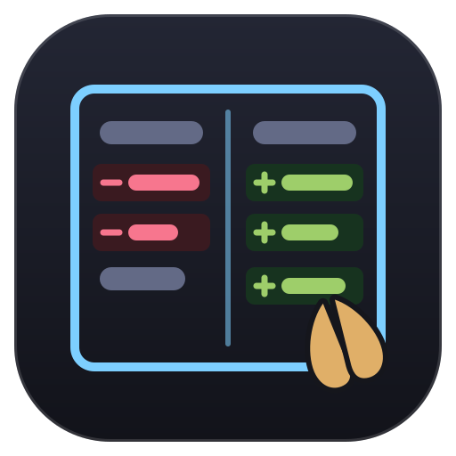
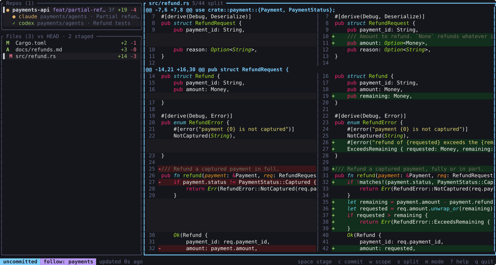
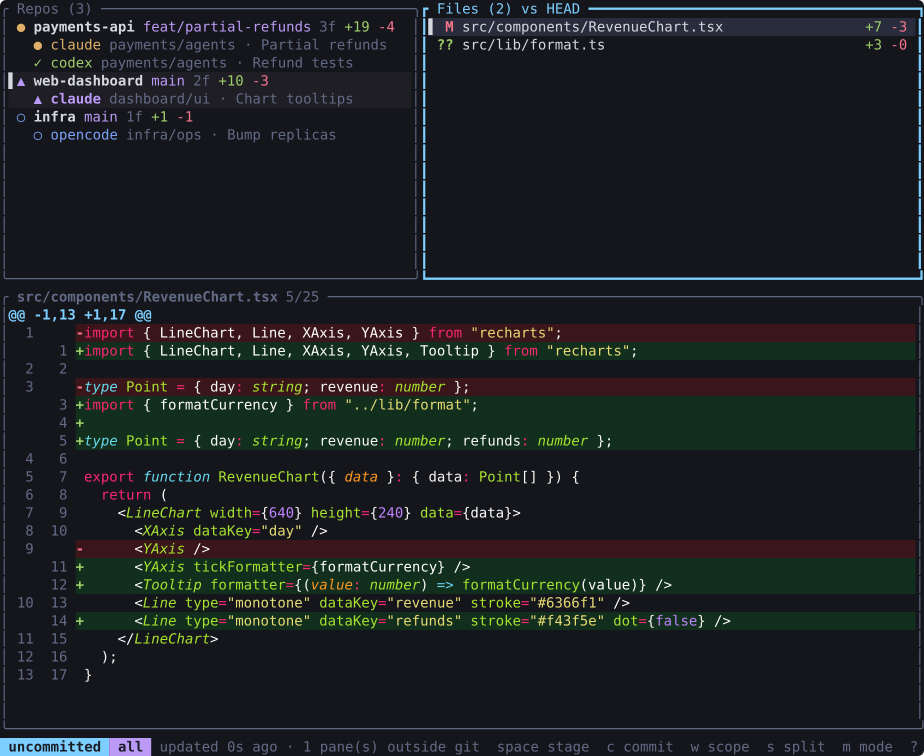
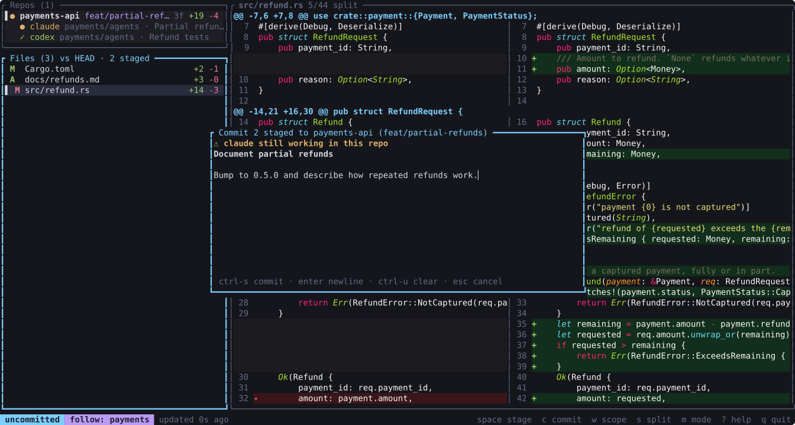
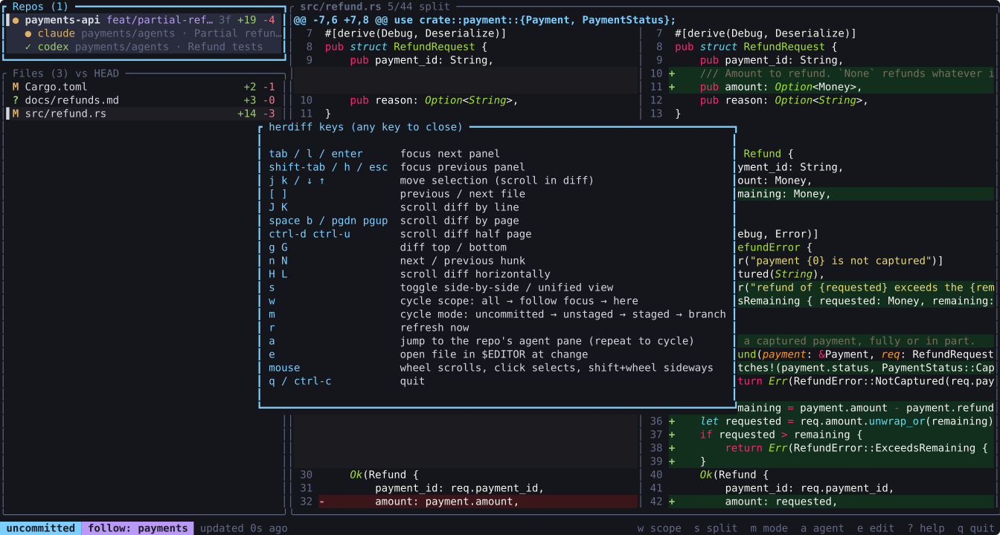

# herdiff



[](https://github.com/TarasKovalenko/herdiff/actions/workflows/ci.yml)
[](LICENSE)

A terminal diff viewer for [herdr](https://herdr.dev). It finds every git repo your herdr
panes are sitting in and shows what changed, grouped by repo, while your agents keep
editing. Leave it open in a side pane and you can watch the work land.

Diffs are syntax highlighted and switch to a side-by-side layout when there's room. When
you like what you see, stage it (whole files or single hunks) and commit without leaving
the viewer.



| | |
| --- | --- |
|  |  |
|  | |

## Install

herdiff runs on macOS and Linux and needs `git` on your `PATH`. Both install routes
build from source, so you also need a Rust toolchain (`cargo`).

### As a herdr plugin

```
herdr plugin install TarasKovalenko/herdiff
```

herdr shows the manifest and the build command before it runs anything. The build is
`cargo build --release --locked` inside herdr's managed checkout, and the first one takes
a minute or two. There's no `plugin update` in herdr yet; run the install again to pick
up a new version.

The plugin adds two actions to herdr's command palette:

- **herdiff: open diff viewer beside this pane** opens a split you can keep open.
- **herdiff: quick look in a popup** opens a 90% popup. Press `q` and it's gone.

To put either on a key, add this to your herdr `config.toml`:

```toml
[[keys.command]]
key = "prefix+d"
type = "plugin_action"
command = "taraskovalenko.herdiff.popup"   # or taraskovalenko.herdiff.open
description = "herdiff quick look"
```

You can also open the panes directly:
`herdr plugin pane open --plugin taraskovalenko.herdiff --entrypoint viewer`.

Like any herdr plugin, this is code running as your user. Read
[herdr's trust guidance](https://herdr.dev/docs/plugins/#trust-and-security) and
[SECURITY.md](SECURITY.md) for what herdiff does.

### As a standalone binary

```
cargo install --git https://github.com/TarasKovalenko/herdiff
```

Or from a local checkout: `cargo install --path .`

## Usage

```
herdiff                   # uncommitted changes (the default)
herdiff -m branch         # changes since you branched off main/master
herdiff --scope all       # every workspace instead of the one you're in
herdiff -d ~/src/other    # also show a repo that has no herdr pane
herdiff --view split      # always side-by-side (auto, unified, split)
herdiff --theme Nord      # pick a highlighting theme
herdiff --read-only       # view only: no staging, no commits
herdiff list --json       # print once and exit, handy for scripts
```

The binary talks to herdr over its socket, so it runs in any terminal, not only inside
herdr. Without the plugin, the usual setup is a split next to your agents:

```
herdr pane split --current --direction right --no-focus
```

Then start `herdiff` in the new pane.

`--view auto` (the default) goes side-by-side once the diff panel is 140 columns wide
and falls back to unified below that. Press `s` to override it for the session.

Highlighting uses the syntax definitions and themes that ship with
[bat](https://github.com/sharkdp/bat), so most languages and config formats work out of
the box. The default theme is Monokai Extended. `herdiff --list-themes` prints the rest;
`ansi` follows your terminal's palette, which is the one to try on a light background.
`--no-highlight` turns it off.

The mouse works too: scroll the panel under the pointer, click a repo or file to select it,
click the diff to focus it. Shift+wheel scrolls the diff sideways. While herdiff has the
mouse, your terminal's own click-and-drag selection won't work (most terminals let you
hold Shift or Option to get it back). `--no-mouse` leaves the mouse to the terminal.

`--socket PATH` points it at a different herdr socket. By default it uses
`$HERDR_SOCKET_PATH`, then `~/.config/herdr/herdr.sock`. `--interval SECS` sets how often
it polls git (2s by default). herdr events trigger a refresh on top of that.

## Scope

With several workspaces open, seeing every repo at once gets noisy. Press `w` to cycle
what herdiff shows:

- **follow**: the workspace you're working in. Jump to another workspace in herdr and the
  view switches with you. Focusing herdiff itself doesn't count, so you can move over to
  read a diff without it changing under you. This is the default inside herdr.
- **here**: the workspace herdiff runs in. Handy when you keep one herdiff split beside
  each agent.
- **all**: every repo in every workspace. The default outside herdr and for `herdiff list`.

herdiff remembers the file and scroll position for each workspace, so switching back puts
you where you left off. Only repos in scope are diffed, so a narrow scope also means less
git work. Repos added with `-d` show up in every scope.

herdr keeps one focus for the whole server, so with several clients attached (say, a
second one over SSH), follow tracks whichever client moved last. If you move herdiff's own
pane to another workspace, restart it: the pane gets a new ID that the running process
never sees.

## Stage and commit

The Files panel shows two status columns, like `git status -s`: the green one is what's
staged, the red one what isn't. `MM` means part of the file is staged. The title counts
staged files.

- `space` on a file stages it, or unstages it once nothing is left to stage. In staged
  mode it unstages.
- `space` in the diff panel stages the marked hunk (the one at the top of the view; `n`
  and `N` move between hunks). This works in unstaged mode, and in staged mode it
  unstages the hunk. In the other modes a hunk mixes staged and unstaged lines, so switch
  with `m` first.
- `A` stages everything, `R` unstages everything.
- `c` opens a commit box for the staged changes. The first line is the subject. `ctrl-s`
  commits, `esc` cancels. Your hooks run; if one fails, its output shows up and the message
  is kept for another try.
- `C` runs plain `git commit` in the terminal instead, for commit templates, `--verbose` or
  signing prompts, and brings herdiff back when it's done. The inline commit runs without a
  terminal, so if signing asks for a passphrase or a hook wants to ask you something, it
  fails straight away and tells you to use `C`.

Agents may be working in the same repo, so a few things behave carefully:

- The commit box warns when an agent in that repo is still `working`, since you might
  commit half of its change.
- Staging and committing need git's `index.lock`. If an agent's git holds it, herdiff
  retries for about a second and a half, then tells you. It never deletes the lock.
- Only these keys write. The background refresh stays read-only.
- herdiff doesn't push, amend or discard anything.

Start with `--read-only` to turn all of this off.

## Modes

Press `m` to cycle through them.

- **uncommitted**: working tree against `HEAD`, untracked files included
- **unstaged**: working tree against the index
- **staged**: index against `HEAD`
- **branch**: working tree against the merge-base with `origin/HEAD`, `main` or `master`

## Keys

| key | action |
| --- | --- |
| `tab` `l` `enter` / `shift-tab` `h` `esc` | next / previous panel |
| `j` `k` | move the selection, or scroll when the diff has focus |
| `[` `]` | previous / next file |
| `J` `K`, `f` `b`, `ctrl-d` `ctrl-u`, `g` `G` | scroll the diff |
| `n` `N` | next / previous hunk |
| `H` `L` | scroll sideways |
| `space` | stage or unstage the selected file, or the marked hunk in the diff |
| `A` `R` | stage all / unstage all |
| `c` | commit staged changes (`ctrl-s` commits, `esc` cancels) |
| `C` | run `git commit` in the terminal |
| `s` | toggle side-by-side / unified |
| `w` | switch scope: follow, here, all |
| `m` | switch mode |
| `r` | refresh now |
| `a` | jump to the repo's agent pane in herdr (press again for the next one) |
| `e` | open the file in `$VISUAL` or `$EDITOR` at the change |
| mouse | wheel scrolls, click selects, shift+wheel scrolls sideways |
| `?` | help |
| `q` | quit |

## How it works

herdiff asks herdr for a session snapshot, keeps the panes in scope, and groups them by
`git rev-parse --show-toplevel`. It subscribes to herdr events (panes and tabs opening or
closing, focus moving, agent status changes) so the list stays current, and polls git in the
background to catch edits that happen between events.

Highlighting runs on the same background thread as git, so a large file never stalls
the UI. Old and new sides are highlighted as separate streams, which keeps a comment or
string opened in a removed line from bleeding into the added ones. Files over 10,000 diff
lines are shown plain.

All diffs come from the `git` CLI, so your git config and worktrees behave as usual.
Refreshes run with `GIT_OPTIONAL_LOCKS=0`, so watching a repo never takes `index.lock`
while an agent is trying to commit. Only the stage and commit keys take the lock.

Nested repos inside a repo (agent worktrees under `.claude/worktrees/`, for example) show
up as one entry marked `repo`. Open them with `-d` if you want their diffs.

The design notes are in [PLAN.md](PLAN.md).

## Contributing

Issues and pull requests are welcome. [CONTRIBUTING.md](CONTRIBUTING.md) has the checks a
change needs, and security reports go through [SECURITY.md](SECURITY.md).

## License

[MIT](LICENSE)
